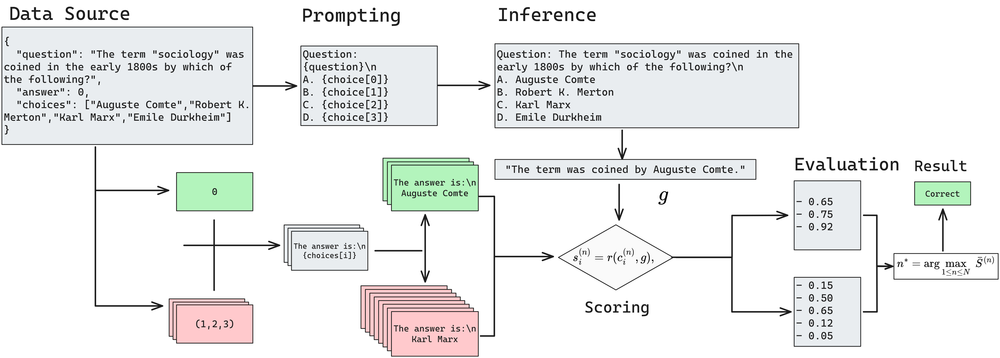

# A-VERT



A-VERT is a method for comparing LM generations to target responses. It is intended to replace the `exact-match` or `logprobs` technique normally used in benchmarks, which makes evaluations diverge from real-world scenarios.

This repository is ordered as follows:
- `./a_vert` : Code for the `a_vert` library.
- `./lm-eval_tasks` : [lm-eval](https://github.com/EleutherAI/lm-evaluation-harness) compatible tasks that use `a_vert` library.
- `./notebooks` : Ipython notebooks used to produce the A-VERT paper results.
- `./examples` : Example deployments using `docker-compose` for both the LLM and A-VERT models.


### Installing

The package is available on pip:

```sh
pip install a_vert
```

### Building

We use poetry to manage the package, to install just do:

```sh
poetry install
```

### Usage

In order to use `a_vert` you need to have an embeddings or reranker model deployed and the access data available in the following environment variables. Please go to the [examples](./examples) folder for more detailed examples of deployment of an LLM and A-VERT model using `docker-compose` with `vLLM`. 

#### Required Environment Variables

The following environment variables are **required** to use A-VERT:

- `AVERT_MODEL_ENDPOINT` : Endpoint of the embedding or reranker model (e.g., `http://127.0.0.1:8000`).
- `AVERT_ENDPOINT_TYPE` : Backend type - either `vllm` (OpenAI-compatible) or `tei`.
- `AVERT_MODEL_NAME` : The name of the `avert` served model (required for `vllm` and `openai` endpoint types).
- `AVERT_METHOD` : Method to use - either `rerank` or `embedding` (**required**, no default value).

#### Template Configuration

You can configure A-VERT templates in two ways:

**Option 1: Use a predefined template** (recommended)

Set `AVERT_PROMPT_TEMPLATE` to one of the following predefined templates:

- `qwen3-reranker` : For Qwen3-Reranker-0.6B-seq-cls, Qwen3-Reranker-4B-seq-cls, Qwen3-Reranker-8B-seq-cls
- `empty` : For gte-reranker-modernbert-base, jina-reranker-v2-base-multilingual, bge-reranker-v2-m3, gte-modernbert-base
- `embedding-with-instruction` : For Qwen3-Embedding-0.6B, Qwen3-Embedding-4B, Qwen3-Embedding-8B, multilingual-e5-large-instruct

**Option 2: Provide custom templates**

If you need custom templates, you can define:

- `AVERT_DOCUMENT_TEMPLATE` : Custom document template string (use `{document}` as placeholder)
- `AVERT_QUERY_TEMPLATE` : Custom query template string (use `{query}` as placeholder)
- `AVERT_INSTRUCTION_PROMPT`: Optional instruction text to be inserted into a template.

If you use `AVERT_INSTRUCTION_PROMPT`, you must include the `{instruction}` placeholder in either your document or query template (but not both).

**Note:** You must either set `AVERT_PROMPT_TEMPLATE` OR provide custom templates via `AVERT_DOCUMENT_TEMPLATE` and `AVERT_QUERY_TEMPLATE`. If neither is set, an error will be raised.

**Method Configuration (Required):**

Regardless of which template option you choose, you **must** specify:

- `AVERT_METHOD` : Either `rerank` or `embedding` (**required**, no default value)

This allows you to use the same template with different methods depending on your model capabilities.

#### Additional Configuration

**Grouping Method:**
- `AVERT_GROUPING` : Method to aggregate distances from multiple candidates (optional, defaults to `max`)
  - Available static methods: `max`, `mean`
  - Available dynamic methods: `mean_top_k_<k>` where `<k>` is an integer (e.g., `mean_top_k_3`, `mean_top_k_5`)
  - Example: `export AVERT_GROUPING="mean_top_k_5"`

**Enhancement:**
- `AVERT_ENHANCE` : Whether to enhance candidate groups - `true` or `false` (optional, defaults to `true`)
  - Example: `export AVERT_ENHANCE="true"`

#### Example Configuration

```bash
# Required
export AVERT_MODEL_ENDPOINT="http://localhost:8000"
export AVERT_ENDPOINT_TYPE="vllm"
export AVERT_MODEL_NAME="avert-model"
export AVERT_METHOD="rerank"  # or "embedding"

# Template (choose one approach)
export AVERT_PROMPT_TEMPLATE="qwen3-reranker"

# OR use custom templates:
# export AVERT_DOCUMENT_TEMPLATE="<Document>: {document}"
# export AVERT_QUERY_TEMPLATE="<Query>: {query}"

# even you can define an {instruction} placeholder that will be replaced with the content of:
# export AVERT_INSTRUCTION_PROMPT="<Your instruction here>"

# Additional (optional)
export AVERT_GROUPING="max"
export AVERT_ENHANCE="true"
```

#### Running a Test Task

To run a test task (2 examples, fast), just use the `lm-eval` library and add the provided tasks as additional tasks: 

```sh
lm_eval \
    --model local-chat-completions \
    --tasks babi-task_01-single_supporting_fact \
    --model_args '{"base_url":"http://localhost:8001/v1/chat/completions","timeout":"600","max_retries":3,"tokenized_requests":false, "model":"llm-model"}' \
    --num_fewshot 0 \
    --apply_chat_template \
    --trust_remote_code \
    --include_path ./lm-eval_tasks \
    --limit 2
```

> Note: please adjust `base_url` and `model` in `model_args` to point to your LLM endpoint if your are using a custom setup.


# Paper

The paper is available [here](). 
In order to reproduce the results, please [download the test data from here (~480 MB)](https://drive.google.com/file/d/1lMh5-MWtOKGw4j9-MEC7Vlywge--DG0t/view?usp=sharing) and extract it in the root of this repository (approx 3.1 GB of space is needed). The notebooks will look for it at: `./data`.

Abstract:
> The automatic evaluation of Language Model (LM) responses is a critical piece in the development of benchmarks and metrics, both for model training and quality assessment of production model endpoints. The current approaches to response classification relies on methods that are too expensive (i.e. LLM-as-a-Judge) or that are far from real-world conditions (string-matching, logprob). In this paper, a structure-free evaluation method is presented. The method makes use of semantic embedding distances to match target candidates with arbitrary LM-generated text, resulting in a robust classification of the response at a relatively low compute cost (embedding models of less than 10B parameters). The results show a regression score of ~0.97 and an accuracy of ~96% against human annotators, tested over 3 data sets and 3 different LM architectures.

## Cite as:
```text
@misc{aguirre2025avertagnosticverificationembedding,
      title={A-VERT: Agnostic Verification with Embedding Ranking Targets}, 
      author={Nicolás Aguirre and Ramiro Caso and Ramiro Rodríguez Colmeiro and Mauro Santelli and Joaquín Toranzo Calderón},
      year={2025},
      eprint={2510.01469},
      archivePrefix={arXiv},
      primaryClass={cs.CL},
      url={https://arxiv.org/abs/2510.01469}, 
}
```